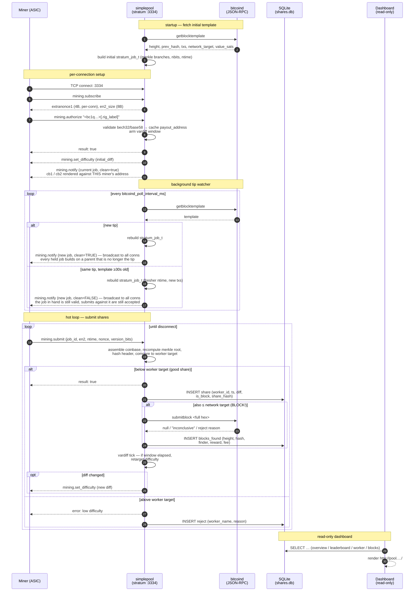

# simplepool

A small, single-binary **stratum server** in pure C11. It accepts miner
connections on TCP `:3334`, builds block templates via `bitcoind`'s
`getblocktemplate`, submits found blocks via `submitblock`, and records every
accepted share into a local SQLite database. A separate Node.js dashboard
reads that file for stats.

It runs in two modes: **solo**, where the miner who finds a block is paid in
that block's own coinbase, and **pps-classic**, where every accepted share
earns a derivable amount paid out over Thunder. Both ship in this repo — see
[The two modes](#the-two-modes) below.

Created by **Roberto Santacroce**.
Canonical repository: <https://github.com/LayerTwo-Labs/simplepool>.

```sh
curl -fsSL https://raw.githubusercontent.com/LayerTwo-Labs/simplepool/main/scripts/install.sh | sudo bash
```

## About simplepool

> simplepool is the foundation for a PPS (Pay-Per-Share) mining pool
> that will eventually pay out using **Thunder**. We've released a
> solo-mining version alongside what we believe will be a genuinely
> useful tool for miners.
>
> The current implementation of shares, calculations, and related
> mechanics exists primarily to establish the **data model and
> architecture** that will underpin the future PPS billing system.
>
> A share is simply your submission from the work you've been assigned —
> it functions as a unit of account. From years of experience mining
> with pools, we've observed that auditing your own contributions is
> extremely difficult, often nearly impossible. Miners are forced to
> trust the pool's reporting, with little ability to independently
> verify what they're owed. simplepool aims to address this transparency
> gap. (Hopefully!)

> A single-file, no-JavaScript explainer covering the modes end to end —
> shares, difficulty, the coinbase, PPS credit, Thunder payouts and how to
> audit every number — lives at [`docs/simplepool.html`](docs/simplepool.html).
> Open it from disk or serve it next to the dashboard.

### The modes

This repository ships **three modes**, selected by `pool_mode` in
`proxy.conf`:

- **`pool_mode = solo`** (default) — every share lands in the local
  SQLite store, every accepted block is paid directly in its own
  coinbase to the miner who found it, and there is no off-chain
  accounting. Stratum username is a Bitcoin address.
- **`pool_mode = proportional`** — coinbase-direct PPLNS. One shared
  coinbase per template pays **every address in the PPLNS window**
  pro-rata by share difficulty, so a block is split among the miners who
  contributed to it rather than going to whoever found it. Like solo it
  holds no funds and needs no payout worker: the coinbase *is* the
  payment, and every miner can verify their own output in the block.
  Requires a server-provided coinbase (`coinbasetxn`), e.g. the CUSF
  enforcer. See [`PROPORTIONAL_PAYOUTS.md`](PROPORTIONAL_PAYOUTS.md).
- **`pool_mode = pps-classic`** — every accepted block's coinbase pays a
  single pool-owned BTC wallet (`pool_btc_address`) as a normal output.
  Each accepted share credits the miner's `pps_credits.accrued_sats` at
  a rate the proxy **derives from each block template** — the block's
  own value over the network difficulty, net of `fee_bps` — so the
  price of a share tracks the chain instead of going stale.
  (`pps_sats_per_diff` exists to pin that rate and should be left
  unset: a pinned value silently bypasses `fee_bps` and cannot follow a
  retarget.) The operator batches the
  accumulated BTC into the pool's Thunder reserve from the admin
  dashboard, and a separate payout service (not in this binary) issues
  Thunder transactions to drain those credits to miners. Stratum
  username is a bare base58 Thunder address — the deposit-format wrapper
  `s9_<base58>_<hex6>` is rejected, since Thunder itself doesn't
  recognize it at the byte level.

  Payouts run as a **daily batch**: once every 24h everyone over
  `PAYOUT_MIN_SATS` goes out in a single Thunder transaction. Settlement of
  an already-broadcast batch runs on its own 30-second clock, because nobody
  in a batch is credited until a tick observes it in a Thunder block. See
  [`payout/README.md`](payout/README.md) for all three clocks.

  > An earlier `pool_mode = pps` put a BIP300 drivechain deposit
  > directly in each coinbase, so the pool would never custody BTC.
  > Regtest and forknet both showed the enforcer does *not* credit
  > coinbase outputs as deposits — the block confirms but the sidechain
  > Ctip never moves, stranding the reward. That mode has been removed;
  > see [`CLASSIC_PAYOUTS.md`](CLASSIC_PAYOUTS.md) for the evidence and
  > the design that replaced it.

In both modes the operator fee stays in BTC, paid to `operator_address`
out of the same coinbase. See [`proxy.conf.example`](proxy.conf.example)
for the full set of PPS / Thunder keys.

Optional: set `redis_url` to mirror accepted shares, rejects, blocks,
tip changes and PPS credits to Redis pub/sub channels (`pool:shares`,
`pool:rejects`, `pool:blocks`, `pool:tip`, `pool:credits`) for the
dashboard and any downstream consumers. SQLite remains the source of
truth; the publish is fire-and-forget.

**In `solo` mode** it is a solo pool with direct payouts: every coinbase has
two outputs — the **miner who found the block gets the reward** (minus a small
operator fee), and the configured `operator_address` gets the rest (default
1% = 100 basis points, configurable via `fee_bps`). Each connected miner gets
its own coinbase rendered against the miner's own address; the merkle
branches, prev-hash, ntime, etc. are shared.

In that mode there is no inter-miner reward sharing and no difficulty-weighted
accounting. If your miner finds the block, your address gets ~99% of the
subsidy + fees on-chain in the same coinbase transaction; if it doesn't,
nobody on this proxy gets anything for that height. The `shares` and `workers`
tables exist so the dashboard can show a leaderboard, per-worker drilldown,
and historical "blocks found by the pool" view.

**In `pps-classic` mode** that inverts: the coinbase pays the pool, every
accepted share credits a balance at a rate derived from the live block
template, and the pool — not the miner — carries the variance.

### A note on terminology: "share" vs "work"

The codebase, schema, dashboard, and API all call accepted submissions
**shares** — never "work units." That's a deliberate choice we want to
hold even though this is currently solo-mode:

- *Share* is the canonical stratum term every miner knows. ASIC
  firmware, mining-pool dashboards, monitoring tools, and blog posts
  all use it. Reusing a different word here would just confuse the
  audience.
- The same column / table / API names will carry through to the PPS
  build, where shares **are** the unit of account that gets billed.
  Renaming `shares` → `work_units` now and back again later would
  churn schema, queries, EJS templates, and any external consumer.
- The meaning shift between solo and PPS is *semantic*, not lexical.
  We surface it with an explanatory banner on the dashboard and with
  the project blurb above, rather than by renaming things.

**In `solo` mode**, a share is an accepted Proof-of-Work submission below the
connection's worker target. It is *not* a payout claim and does not accrue a
balance — it exists for hashrate estimation, per-rig accountability, and as
the data primitive the PPS billing path consumes. **In `pps-classic`** the
same row additionally carries `credited_sats` and the `rate_used` that
produced it, and *is* the unit of account.

### How the solo flow actually works



Key invariants the diagram glosses over but the code enforces:

- **Per-connection coinbase.** Each miner's `cb1`/`cb2` pay *that*
  miner's address; the operator fee output is identical across miners.
  Two ASICs on the same address but different `.rig_label` get
  distinct `extranonce1` values, so their work never overlaps. That
  uniqueness is process-wide, not per-listener — see
  [NONCE_AND_SHARES.md](NONCE_AND_SHARES.md), and the rental port below.
- **Optional rental port.** A second stratum listener
  (`rental_listen_port`) serving a fixed high share difficulty, for
  hashrate marketplaces that require one. Off by default. Shares from
  both ports feed the same PPLNS window and the same coinbase; the
  ports differ only in the difficulty they serve. See
  [RENTED_HASHRATE.md](RENTED_HASHRATE.md).
- **WAL writes are batched.** `store_record_share` enqueues into a
  lock-free ring; the writer thread commits batches every
  `commit_window_ms` (default 100) or every `commit_max_shares`
  (default 100), whichever first.
- **vardiff doesn't invalidate the active job.** A
  `mining.set_difficulty` only relaxes/tightens the per-share check;
  the current `mining.notify` stays valid against it. We do not force
  a re-notify on a difficulty change. Each job also carries the
  difficulty it went out under, so a submit is judged at *that* value
  rather than whatever the connection has drifted to since.
- **`clean_jobs` is an instruction, not a description.** It means
  "throw away the work you are holding", and only a tip change makes
  that true. The periodic template refresh sends `clean_jobs=false`:
  the job in hand still builds on the current tip, and the pool goes on
  accepting submits against it out of an 8-deep retention ring. Sending
  it as true on every refresh discards work in flight on every
  connected miner ~20 times per block, which is invisible to a probe
  that reads one notify and leaves.
- **More than one stratum port.** A `listener` line binds an extra port
  with its own difficulty policy, so a rented fleet and a home ASIC can
  be served by the same pool without either getting the other's
  difficulty. `listen_port` is unaffected, and a config naming no
  listeners binds exactly what it always did.

### Stratum username convention

The `mining.authorize` username must start with the miner's Bitcoin
address. Format:

```
<bitcoin_address>[.<rig_label>]
```

- `bitcoin_address` is required and must be a valid bech32 (P2WPKH) or
  base58check (P2PKH / P2SH) address. It is parsed at authorize time
  and an invalid address is rejected with a clear error and logged in
  the `rejects` table.
- `rig_label` is optional and lets a single miner (same address) have
  multiple rigs in the leaderboard as separate rows. Use anything
  alphanumeric plus `_` `-`.
- The **password is discarded** entirely. There are no accounts and no
  auth.

Examples: `bc1qabc…`, `bc1qabc….basement-rig`, `bcrt1q…test.alice`.

`simplepool` is deliberately small: one C binary for the hot path, one
read-only Node dashboard, one Node payout worker, and a SQLite file that is
the source of truth for all three. Nothing in the stratum path depends on the
dashboard or the payout worker being up — a billing outage must never stop the
pool accepting work or submitting blocks.

## Install

On a fresh Ubuntu or Debian server:

```sh
curl -fsSL https://raw.githubusercontent.com/LayerTwo-Labs/simplepool/main/scripts/install.sh | sudo bash
```

That downloads the published build for the machine's architecture, checks it
against the release `SHA256SUMS`, then interviews you for the rest — pool mode,
bitcoind RPC, your operator address, dashboard domain, nginx and TLS — and
leaves a running pool behind nginx with a `simplepoolctl` command to drive it.
No compiler and no clone: `--from-source` if you want those instead. Answers
are saved, so re-running it is how you change your mind about any of them.

```sh
simplepoolctl status      # what's running, on which ports, at which version
simplepoolctl doctor      # check the things that actually break in production
simplepoolctl logs -f     # follow every service at once
simplepoolctl upgrade     # move to the next release, then restart
simplepoolctl uninstall   # remove the services (--purge also drops the data)
```

Full walkthrough, including the manual steps the script automates, is in
[INSTALL.md](INSTALL.md). To cut a release, see [RELEASING.md](RELEASING.md).

## Build from source

Dependencies: `sqlite3`, `libcurl`, `libhiredis`, `pthread`, plus a C11 compiler.

macOS:
```
brew install sqlite curl hiredis
make
```

Debian / Ubuntu:
```
sudo apt install build-essential libsqlite3-dev libcurl4-openssl-dev libhiredis-dev
make
```

The binary lands at `build/simplepool`.

## Run

```
cp proxy.conf.example proxy.conf
# edit proxy.conf
./build/simplepool proxy.conf
```

Initialise the SQLite database from the shipped schema:
```
mkdir -p data
sqlite3 data/shares.db < schema.sql
```

## Database & dashboard snapshot

The proxy is the only writer. The database lives at `data/shares.db` and
runs in WAL mode, so a read-only consumer cannot block writes or corrupt
the file.

For the dashboard we still recommend pointing it at a **separate snapshot
file** rather than the live DB. This isolates the dashboard's query load
from the proxy's writer and means a future code change on the dashboard
side can never accidentally open the live file read-write.

Use SQLite's online backup — it is atomic and safe to run while the proxy
is writing. A plain `cp` of a WAL'd database is **not** safe; always use
`.backup`:

```
# one-shot
sqlite3 data/shares.db ".backup data/shares.snapshot.db"
```

Run it on a timer (cron / systemd-timer / launchd), e.g. every minute:

```
* * * * * sqlite3 /path/to/data/shares.db ".backup /path/to/data/shares.snapshot.db"
```

The dashboard reads `data/shares.db` (the live DB) by default. Point it
at a snapshot via `PROXY_DB_PATH` if you want — see
[`dashboard/README.md`](dashboard/README.md).

## Deploy to a server

[`scripts/install.sh`](scripts/install.sh) (see [Install](#install) above) is
the way to bring a box up from nothing. `scripts/deploy-to-server.sh` is the
other direction: it drives an *already installed* box from your workstation,
which is what you want while iterating on code that isn't released yet. It is
idempotent: re-run it after every change.

```
./scripts/deploy-to-server.sh \
    --host     user@host \
    --root     /home/user/simplepool \
    --hostname pool.example.com \
    --ssh-key  ~/.ssh/id_yourkey
```

What the script does, end to end:

1.  `git fetch && git reset --hard origin/main` on the remote checkout.
2.  `apt-get install` build deps + nodejs + sqlite3 + nginx + ufw.
3.  `make` the C proxy.
4.  `npm install` in `dashboard/`.
5.  Initialise `data/shares.db` from `schema.sql` if missing.
6.  Run the one-shot ms→seconds timestamp migration (idempotent — it
    only updates rows where `ts > 10^10`, which can only be milliseconds).
7.  Render the two systemd unit templates in [`deploy/systemd/`](deploy/systemd/)
    with the right user / root path, install to `/etc/systemd/system/`,
    `enable --now` both.
8.  Drop the nginx vhost from [`deploy/nginx/`](deploy/nginx/) into
    `sites-available`, symlink to `sites-enabled`, `nginx -t && reload`.
    Open ports 80 / 443 / 3334 via `ufw` if active.

Files in [`deploy/`](deploy/) are templates with `@USER@` and `@ROOT@`
placeholders the script substitutes — feel free to hand-install them if
you want to do the steps yourself.

Stratum is raw TCP, not HTTP, so it does **not** go through nginx by
default. Miners connect directly to `host:3334`. Point your stratum
hostname (e.g. `stratum.example.com`) at the box's IP via DNS; if you
ever need TLS for stratum, you'd add a `stream { ... }` block to nginx
or use `stunnel`.

### Operations

```
simplepoolctl status                            # services, ports, ledger totals
simplepoolctl logs proxy -f                     # stratum log
simplepoolctl logs dashboard -f                 # dashboard log
sudo simplepoolctl restart proxy                # after changing proxy.conf
```

`simplepoolctl` is a wrapper over systemd — the underlying commands
(`systemctl status simplepool`, `journalctl -u simplepool -f`) work exactly as
before, and are what it prints when something needs a closer look.

To pull edits made directly on a server back into a local checkout (so
you can commit + push from here), use
[`scripts/sync-from-server.sh`](scripts/sync-from-server.sh).

### Docker

An alternative to the bare-metal script: containerized builds of the
three services (stratum proxy, dashboard, payout worker) under
[`deploy/docker/`](deploy/docker/). One `docker compose up -d --build`
gets the whole app stack running against a Thunder daemon and Bitcoin
Core that live on the host (or wherever you point them). Shared bind
mount on `data/` so the SQLite ledger is portable across restarts /
image rebuilds. See [`deploy/docker/README.md`](deploy/docker/README.md)
for the full walkthrough.

Note: the drivechain infrastructure (`bitcoind`, Thunder, the
`bip300301_enforcer`, `electrs`) is intentionally NOT containerized —
those daemons have their own lifecycles and typically run bare-metal on
the same host.

## Config keys

```
operator_address = bc1q...   # required: recipient of the fee_bps cut
fee_bps          = 100       # 100 = 1%; valid range 0..1000 (max 10%)
coinbase_tag     = /simplepool/ # short string baked into the coinbase scriptSig
```

These are the keys you have to think about; every key the proxy accepts
is documented inline in [`proxy.conf.example`](proxy.conf.example),
which is the reference rather than this list.

`fee_bps = 0` disables the fee output (single-payout coinbase, all to
the miner). If the computed fee would be below the relay dust threshold
(~546 sats) the operator output is dropped automatically and the miner
gets the full reward.

`bitcoind_user` / `bitcoind_pass` are optional: omit both for a
block-template backend that accepts unauthenticated JSON-RPC, and the
proxy issues the RPC call without a basic-auth header. Set
`log_level = debug` to log every RPC request and raw response.

## How shares are credited

One accepted share = one row in the `shares` table, tagged with the
`worker_id` resolved from the (sanitized) stratum username — which now
encodes the miner's payout address. The `workers` row stores
`payout_address` separately so the dashboard can also roll up by
address across multiple rigs.

If a share also satisfies the network target, it is additionally
recorded in `blocks_found` with `height`, `hash`, `finder_id`,
`finder_address`, `reward_sats` (paid to the miner), and `fee_sats`
(paid to `operator_address`). The matching `shares` row has
`is_block = 1` and the block hash.

That row is a block **candidate**, and `status` says which it turned out
to be. `submitblock` can refuse it (`rejected`, with the node's reason in
`submit_error`); an accepted one is `pending` until the block is verified
to be in the chain (`confirmed`), and a reorg moves it to `orphaned`.
**Only `confirmed` counts as a block or as pool revenue** — every count and
every sum of `reward_sats` filters on it, because a refused or reorged
candidate pays nothing. On a low-difficulty chain most candidates are one
of the latter, which is normal; the dashboard reports the orphan rate
rather than hiding it.

Verification prefers `getblockhash`. Backends that do not serve it — the
CUSF enforcer answers only `getblocktemplate` and `submitblock` — are
handled by comparing against the chain of tips the pool has already
observed through `templates`, and `checked_via` records which of the two
answered. A candidate neither can speak to stays `pending` and counts as
nothing.

`shares.is_block` keeps its own meaning: the hash met the network target.
That is what the miner did, and it stays true whatever the chain later
decided.

### PPS is only safe once difficulty has caught up

`pool_mode = pps-classic` derives the rate from each template as
`coinbasevalue / network_difficulty`, which is a share's expected value. That
holds only while difficulty is calibrated to hashrate. On a new chain it is
not — difficulty starts at 1 and climbs — and until it catches up the pool
produces solutions far faster than the chain accepts blocks, so the formula
prices every share as though it were worth a whole block.

Set `pps_min_network_difficulty` to the difficulty at which your pool alone
would find one block per block interval:

```
pps_min_network_difficulty = hashrate_H/s * block_interval_sec / 2^32
```

A 40 TH/s pool on a 600-second chain needs roughly **5,600,000**. Below that
the proxy credits nothing, refuses new miners by default rather than taking
work it will not pay for, and resumes on its own once the chain retargets. A
separate automatic ceiling caps accrual at what the chain can actually mint,
but it needs a minute of hashrate history and so cannot cover a restart — the
floor is what does.

Left at 0 the check is off, which is only safe on mainnet, testnet or signet.
A pool that skipped it on a forknet accrued 15,561,471 BTC of liability in
under four hours against 943.60 BTC actually mined.

## Run against local regtest

The repo ships a best-effort integration test that exercises the proxy
end-to-end against a regtest `bitcoind`:

```
# bitcoind must already be running with -regtest, RPC on 127.0.0.1:18443,
# user/password "drivepool"/"drivepool" (or override with env vars).
chmod +x tests/test_integration.sh
./tests/test_integration.sh
```

The script:

1. Skips with exit 0 if `bitcoin-cli`, `nc`, or `sqlite3` are missing, or
   if no regtest node is reachable.
2. Mines 101 blocks if needed so templates are non-empty.
3. Writes `tests/integration.proxy.conf` and starts `./build/simplepool` on
   `127.0.0.1:13334` with the DB at `/tmp/simplepool-int.db`.
4. Sends a tiny `mining.subscribe` / `mining.authorize` / stale
   `mining.submit` sequence over `nc`, then `SIGINT`s the proxy.
5. Asserts that `workers` has at least one row, `workers.payout_address`
   is populated, and `rejects` has at least one row.

There is also a full end-to-end regtest (`tests/test_e2e_regtest.sh`) and a
payout regtest (`tests/test_payout_regtest.sh`); both run in CI. For the
verification checklist behind each mode, see [`VERIFY.md`](VERIFY.md).

## Layout

```
Makefile             # build / clean / test / format / install
schema.sql           # SQLite schema (WAL, 4 tables — workers, shares,
                     # rejects, blocks_found)
proxy.conf.example   # key = value config
src/
  main.c             # entry point: config + bitcoind + store + stratum + tip watcher
  config.{c,h}       # tiny key=value config parser
  coinbase.{c,h}     # BIP34 coinbase tx builder; bech32 + base58check decoders
  log.{c,h}          # tiny pthread-safe stderr logger
  share.{c,h}        # share-validation math
  sha256.{c,h}       # vendored SHA-256
  stratum.{c,h}      # stratum v1 server
  store.{c,h}        # SQLite writer with batching
  bitcoind.{c,h}     # libcurl-based JSON-RPC client
  broadcast.{c,h}    # optional Redis pub/sub mirror of pool events
  thunder.{c,h}      # Thunder base58 address decoder (pps-classic)
  version.{c,h}      # build provenance compiled into the binary
  cjson/             # vendored cJSON (MIT) — see src/cjson/README.md
tests/               # unit tests + integration shell scripts
deploy/              # systemd unit templates + nginx vhost templates
scripts/
  install.sh         # bootstrap a fresh box (release download or source build)
  simplepoolctl      # status / logs / doctor / upgrade / uninstall
  release.sh         # build a release tarball (CI runs this exact script)
  deploy-to-server.sh, sync-from-server.sh, record-build.sh, ...
dashboard/           # Node/Express read-only stats UI
payout/              # Thunder payout worker (pps-classic)
docs/simplepool.html # single-file explainer: both modes, end to end
```

## Roadmap

The share/block data model in `schema.sql` has not had to change as the pool
grew from solo-only to PPS, and the items below are not expected to change it
either.

Shipped since this list was first written:

- **Redis broadcast.** Accepted shares, rejects, blocks, tip changes and PPS
  credits are mirrored onto Redis pub/sub when `redis_url` is set. SQLite
  remains the source of truth; the publish is fire-and-forget.
- **PPS billing as a separate, non-blocking service.** `pool_mode =
  pps-classic` accrues credits in the proxy; the separate
  [`payout/`](payout/) worker settles them over **Thunder** on its own
  process and its own schedule. A payout outage cannot stop the proxy
  accepting work.
- **Miner registration turned out to be unnecessary.** PPS miners are
  identified by the Thunder address in the stratum username, exactly as solo
  miners are identified by their BTC address. There is nothing to register.

Still open:

1. **Automatic BTC → Thunder deposits.** Today the operator presses a button
   per deposit (see [`CLASSIC_PAYOUTS.md`](CLASSIC_PAYOUTS.md)). An
   auto-batching worker needs no schema change — just a service that posts to
   `/admin/deposit`.
2. **Status and observability.** Expose Prometheus-style metrics
   (`/metrics`), structured logs, and per-connection health for both
   the proxy and the billing service. The goal is for any miner to be
   able to audit their own contribution end to end without having to
   trust an opaque "pool dashboard."
3. **Richer dashboard metrics.** Build on the current overview / per-
   worker / blocks pages with per-rig hashrate variance, expected-vs-
   observed payouts, network-difficulty overlays, and historical
   charts that go beyond the rolling 24-hour window.
4. **Decouple the dashboard from the live database.** Have the
   dashboard read its own derived store (a Redis replica or a periodic
   materialised view) rather than the proxy's primary SQLite file.
   That keeps the dashboard's read pattern from ever touching the hot
   write path.

## Author

**Roberto Santacroce** — <https://github.com/rsantacroce/simplepool>

Issues, pull requests, and notes from miners running this in the wild
are all welcome.

## License

simplepool is released under the **MIT License**, © 2026 Roberto
Santacroce (see [`LICENSE`](LICENSE)).
The vendored cJSON code in `src/cjson/` is also MIT-licensed (see
[`src/cjson/README.md`](src/cjson/README.md)).
